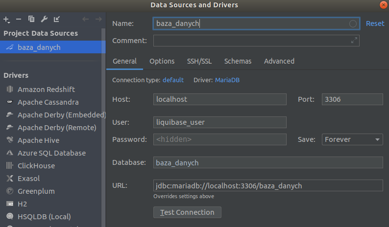

## Getting started

Prerequists:
- [Docker Desktop](https://www.docker.com/products/docker-desktop) with [DockerCompose](https://docs.docker.com/compose/)
- [Maven](http://maven.apache.org/)

**Important** The docker on Windows work only on Professional and Ultimate version due to not 
supported Hyper-V technology on Windows Home Edition

After installation Docker Desktop and DockerComposer go to terminal change directory to [./docker](./docker)
```bash
cd docker
```
Then run docker container

Linux
```bash
sudo docker-compose up
```
Mac OS
```bash
docker-compose up
```


Stopping docker:
Linux
```bash
sudo docker-compose stop
```

Mac OS
```bash
sudo docker-compose stop
```


**Important** to allow stop container all connections to DB must be closed!

### Connections
Connection parameters:


The username and password are taken from [docker-compose.yml](./docker/docker-compose.yml)
under `MYSQL_USER` and `MYSQL_PASSWORD`. 
The URL is standard MySql jdbc URL `jdbc:mysql://localhost:3306/TR01` and connect to database created 
on start with name provided as `MYSQL_DATABASE`. For more [Docker Hub MySql](https://hub.docker.com/_/mysql)
under **Environment Variables**